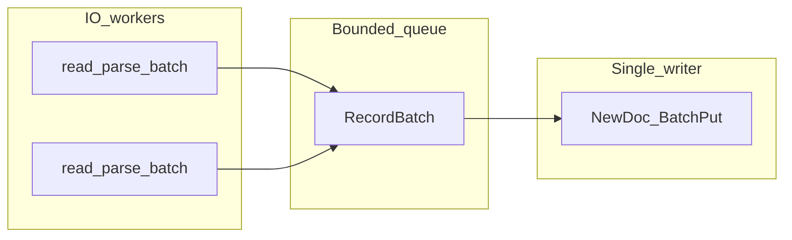

# yikv-server 技术说明（db.md）

面向实现与排错；**安装、命令速查、流程导读**见 **[`README.md`](README.md)**。

---

## 1. 概述

- **存储引擎**：同级目录 [yikv](../yikv)，mmap arena + `KVIndex`（主键 → 文档）。
- **进程 `yikv_server`**：在 **`listen`** 上同时提供 **brpc `baidu_std`** 与 **gRPC `h2:grpc`**，业务载荷均为 **FlatBuffers**（[`proto/yikv_server.fbs`](proto/yikv_server.fbs)）。
- **离线 bulk**：唯一入口 **`yikv_import_pipeline`**（Parquet/CSV、云 URI、MySQL 线协议）；与服务器共用 **`config.json`**，写路径默认 **`AllocatorMode::SingleWriter`**。
- **实时增量（可选）**：每表 **`table.json`** + **`KafkaSource`**，消息为 JSON（见 §6）。

---

## 2. 环境与构建

**Bazel**：[`MODULE.bazel`](MODULE.bazel)、[`.bazelversion`](.bazelversion)。拉取 **brpc**、与 yikv 对齐的 **protobuf / leveldb** 等。

**系统**

- **OpenSSL**（`-lssl -lcrypto`）。
- **FlatBuffers**：`libflatbuffers-dev` 或与 [`deps/include`](deps/include) 一致的头文件；C++ 生成物为 [`gen/yikv_server_generated.h`](gen/yikv_server_generated.h)。
- **Arrow / Parquet**：导入与 `yikv_server_bench` 的 Parquet 键源需要 `libarrow-dev`、`libparquet-dev`（或等价）。
- **MySQL 源**：`libmysqlclient-dev` + 运行时 `libmysqlclient.so`。

**生成 FlatBuffers（可选 Python 绑定）**

```bash
pip install flatbuffers   # 仅当需要 flatc --python 运行时
flatc --python -o tools/yikv_fb_gen proto/yikv_server.fbs   # 生成包 tools/yikv_fb_gen/yikv/
flatc --cpp -o gen proto/yikv_server.fbs                      # gen/yikv_server_generated.h，namespace yikv
```

**构建目标**

```bash
bazel build //:yikv_server //:yikv_import_pipeline //:yikv_server_bench
```

---

## 3. 全局配置与表目录

**`config.json`**（与 [`config.example.json`](config.example.json) 对齐）由 **`yikv_server`** 与 **`yikv_import_pipeline`** 共用。其中 **`db_path`、`arena_seg_gb`、`arena_max_gb`、`exclusive_arena_lock`** 只能从 JSON 读取，**禁止**在导入 CLI 覆盖，以免与线上不一致。

| 键 | 说明 |
|----|------|
| `db_path` | 库根路径 |
| `listen` | 默认 `0.0.0.0:9000` |
| `arena_seg_gb` / `arena_max_gb` | arena 单段与总上限 (GiB) |
| `exclusive_arena_lock` | `true` 时对 `arena.lock` 排他；导入与服务勿并发写 |
| `kafka.default_brokers` | 全局 Kafka；表级可覆盖 |
| `admin_unix_socket` | 可选；本机 **AF_UNIX** 监听路径。连上后发送一行 **`reload <表名>`**（可带换行）。**表已在内存**：在备用 DB 键上 **`OpenIndex`**（`表名` 与 `表名~reload` 交替）、切换 live `TableSlot` 后新请求即走新 mmap，再在途 RPC 结束后 **`CloseIndex`** 旧键。**表尚未加载**：对 `{db_path}/{表名}/` 做首次打开，等价启动时的 `LoadTable`（当前只有一单版本，不做双缓冲）。磁盘上 **`{db_path}/*~reload`** 为内部预留，勿作业务表名。 |

**表目录**：`{db_path}/{表名}/`（可为符号链接，例如指向某 release 根下的 `active`。）

| 路径 | 说明 |
|------|------|
| arena 文件等 | 由 yikv / 导入工具维护 |
| `schema.json` | 字段、`pk`、类型 |
| `table.json` | 可选；Kafka `topic`、`partition`、`brokers` |

服务启动时对 `db_path` 做一次扫描并打开子目录表（**跳过**以 *`~reload` 结尾的目录名**，内部热重载预留）。**运行期中**若有新的 `{db_path}/{表名}/`，可发 **`reload <表名>`** 做首次打开，无需重启。已加载的表在换盘侧 **`active`** 变更后同样发 **`reload <表名>`** 跟到新目录。

---

## 4. RPC 契约（双栈）

### 4.1 brpc `baidu_std`

- **Service（meta）**：`yikv.db.YikvDb`
- **方法**：`Get` / `Put` / `PutBatch` / `BatchGet`
- **体**：FlatBuffers 根表 `GetRequest`↔`GetResponse` 等，置于 **`SerializedRequest.serialized_data` / `SerializedResponse.serialized_data`**（裸 `Finish` 字节）。

### 4.2 gRPC `h2:grpc`

- **Proto**：[`proto/yikv_grpc.proto`](proto/yikv_grpc.proto)，`option cc_generic_services = true`
- **全名**：`yikv.db.YikvDb`（方法名同上）
- **`FbRpcRequest.payload` / `FbRpcResponse.payload`**：与 4.1 **完全相同**的 FlatBuffers 字节

**客户端**：任意语言 gRPC + 由 `yikv_grpc.proto` 生成的 Stub；C++ 也可用 brpc：`ChannelOptions.protocol = "h2:grpc"` + `yikv::db::YikvDb_Stub`（参考 brpc `example/grpc_c++/client.cpp`）。

**PutBatch**：整批原子——任一行失败则整批 `ok=false` 且不 `Publish`；全部成功后一次 `Publish()`。空批或缺 `rows` 报错。

---

## 5. 离线导入：`yikv_import_pipeline`

### 5.1 架构（单写 + 有界队列）

多 **Source** 线程（文件 claim 或 MySQL 单连接仅一线程真正拉流）产出 **`arrow::RecordBatch`**，经 **`BoundedParsedBatchQueue`** 由 **唯一写线程** 执行 `NewDoc`、列填充、`BatchPut`。队列中不传递跨线程的 `Doc*`。



- **统一写侧**：[`src/import/arrow_doc_helpers.cc`](src/import/arrow_doc_helpers.cc)（Arrow → `Doc`）
- **文件 / 云**：[`src/indexer/source/file/file_source.cc`](src/indexer/source/file/file_source.cc)、[`cloud_filesystem.cc`](src/indexer/source/file/cloud_filesystem.cc)
- **MySQL 线协议**：[`src/indexer/source/sql/mysql_wire_source.cc`](src/indexer/source/sql/mysql_wire_source.cc)
- **入口**：[`src/import_pipeline_main.cc`](src/import_pipeline_main.cc)

**schema**：列名须与 `schema.json` 一致（**不区分大小写**）；CSV / MySQL **不支持数组字段**。新建索引时 **`bucket_bits`** 由估计行数推导；文件模式用 Parquet 元数据 / CSV 行数，MySQL 模式用 **`--sql_est_rows`**（可填 `COUNT(*)`）。

**容量与兼容**：单索引主键规模随 yikv 版本变化（约数千万级量级）。**旧版 HashMap v1** 目录升级后可能无法打开，需删表目录后 `--create_if_missing` 全量重导。

### 5.2 CLI 摘录

| 标志 | 含义 |
|------|------|
| `--config` | 与服务器相同的 `config.json` |
| `--index` | 表名 → `{db_path}/{index}/` |
| `--input` / `--input_list` / `--input_dir` | 本地或云 Parquet/CSV |
| `--schema_json` / `--create_if_missing` / `--recreate` | 建表 / 重建 |
| `--no_arena_lock` | 本次跳过 flock（慎用） |
| `--import_io_workers` | 默认 4；MySQL 单连接时仅一线程工作 |
| `--import_queue_batches` | 队列批上限，默认 32（背压） |
| `--mysql_*` / `--mysql_query_file` | MySQL 兼容源；详见 [`examples/mysql_import/README.md`](examples/mysql_import/README.md) |
| 环境变量 | `MYSQL_HOST`、`MYSQL_USER`、`MYSQL_PASSWORD`/`MYSQL_PWD`、`MYSQL_DATABASE`、`MYSQL_TCP_PORT`/`MYSQL_PORT`；`YIKV_MYSQL_*` 同义；CLI 优先 |

### 5.3 云对象存储环境变量

导入前对输入里出现的 scheme 初始化对应 Arrow `FileSystem`（[`cloud_filesystem.h`](src/indexer/source/file/cloud_filesystem.h)）：

| Scheme | 环境变量（摘要） |
|--------|------------------|
| `oss://` | `OSS_ENDPOINT`、`OSS_ACCESS_KEY_ID`、`OSS_ACCESS_KEY_SECRET`；可选 `OSS_REGION` |
| `s3://` | AWS 默认凭证链 |
| `cos://` | `COS_SECRET_ID`、`COS_SECRET_KEY`；`COS_ENDPOINT` 或 `COS_REGION` |
| `obs://` | `OBS_ENDPOINT`、`OBS_ACCESS_KEY_ID`、`OBS_SECRET_ACCESS_KEY`；可选 `OBS_REGION` |
| `gs://` | Google **Application Default Credentials**（如 `GOOGLE_APPLICATION_CREDENTIALS`） |

前缀以 **`/`** 结尾时在导入工具内 **展开**为对象列表（仅 `.parquet`/`.csv`）。

### 5.4 后续扩展

Hive / ODPS 等可实现新 **`Source`**，仍产出 `RecordBatch`，写线程与队列语义不变。多写线程、`AllocatorMode::Concurrent` 等需额外引擎与业务契约，当前默认不启用。

---

## 6. Kafka：`table.json` 与消息格式

表级结构见 [`src/yikv_server/table_config.h`](src/yikv_server/table_config.h)。全局默认 broker：`config.json` → `kafka.default_brokers`。

每条消息：**JSON 对象**（单条）或 **JSON 数组**（批量）。

**单条示例**

```json
{ "_op": "INSERT", "_ts": 1746784320000, "id": "abc", "score": 42, "tags": ["x","y"] }
{ "_op": "UPSERT", "_ts": 1746784321000, "id": "abc", "score": 99 }
{ "_op": "DELETE", "_ts": 1746784322000, "id": "abc" }
```

**批量示例**

```json
[
  { "_op": "INSERT", "_ts": 1746784320000, "id": "1", "name": "Alice" },
  { "_op": "DELETE", "_ts": 1746784321000, "id": "2" }
]
```

| 字段 | 必填 | 说明 |
|------|------|------|
| `_op` | ✓ | `INSERT` / `UPSERT` / `DELETE`（大小写不敏感） |
| `_ts` | ✓ | Unix 毫秒时间戳 |
| 其它 | — | 与 schema 字段名对应；未知字段可忽略 |

- **INSERT** → `Put`（PK 已存在时行为依赖实现，宜保证幂等）
- **UPSERT** → `Upsert`
- **DELETE** → `Delete`（仅需 PK）

offset 持久化等运行细节以源码为准。

---

## 7. 客户端压测：`yikv_server_bench`

对 **Get** 发压，协议 **brpc `baidu_std`**（与线上一致）。

```bash
bazel run //:yikv_server_bench -- \
  --server 127.0.0.1:9000 \
  --index my_table \
  --keys_file ./pks.txt \
  --workers 8 \
  --requests 50000
```

- **`--server`**：别名 **`--grpc_target`**
- 键源：**`--keys_file`** 或 **`--local_parquet PATH --pk COLUMN`**
- 负载：`--requests N` 与 `--duration_sec T` 二选一
- 输出：一行 JSON（`qps`、延迟分位、`index_get` 等）

---

## 8. 源码与生成物索引

| 路径 | 作用 |
|------|------|
| [`proto/yikv_server.fbs`](proto/yikv_server.fbs) | FlatBuffers 业务契约 |
| [`proto/yikv_db_wire.proto`](proto/yikv_db_wire.proto) | brpc meta 名称文档 |
| [`proto/yikv_grpc.proto`](proto/yikv_grpc.proto) | gRPC `yikv.db.YikvDb` |
| [`gen/yikv_server_generated.h`](gen/yikv_server_generated.h) | `flatc --cpp` 生成 |
| [`src/yikv_server/main.cc`](src/yikv_server/main.cc) | 服务入口 |
| [`src/yikv_server/rpc/db_brpc_service.cc`](src/yikv_server/rpc/db_brpc_service.cc) | brpc 分发 |
| [`src/yikv_server/rpc/db_grpc_service.cc`](src/yikv_server/rpc/db_grpc_service.cc) | gRPC 实现 |
| [`src/yikv_server/db/handlers.cc`](src/yikv_server/db/handlers.cc) | 索引与编解码 |
| [`src/yikv_server/kafka/kafka_source.cc`](src/yikv_server/kafka/kafka_source.cc) | Kafka 消费 |
| [`src/bench_main.cc`](src/bench_main.cc) | `yikv_server_bench` |
| [`src/import_pipeline_main.cc`](src/import_pipeline_main.cc) | `yikv_import_pipeline` |

---

## 9. 与 README 的关系

- **[`README.md`](README.md)**（中文）：项目作用、安装、端到端流程（建索引 → 启服务 → 调用思路）、benchmark 速查。
- **[`README.en.md`](README.en.md)**（English）：同上结构的英文版。
- **本文**：RPC 细节、导入流水线、云变量、Kafka 正文、源码地图；修改行为时优先更新此处并与 README / README.en 交叉检查。
