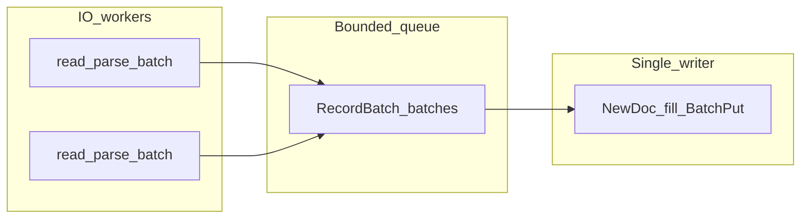

# yikv-server（yidiandb）

基于 [yikv](../yikv) 的 KV 存储，对外在同一监听地址上提供 **双栈** 读写：**brpc `baidu_std` + `BaiduMasterService`（SerializedRequest 承载 FlatBuffers）**，以及 **标准 gRPC `h2:grpc`**（[`proto/yikv_grpc.proto`](proto/yikv_grpc.proto) 的 `FbRpcRequest/FbRpcResponse.payload` 内仍为 FlatBuffers）。离线 bulk 导入由 **`yikv_import_pipeline`** 完成（Parquet/CSV、云 URI、MySQL 协议等，见下文）。

`yikv_import_pipeline` 提供 **多 IO 线程读/解析 + 单线程 `NewDoc`/`BatchPut`**（含 **oss:// / s3://** 等与 **MySQL 协议**拉数），与 `yikv_server` 共用 `config.json`，默认 **`AllocatorMode::SingleWriter`**；详见「通用导入流水线」。表 **`schema.json`** 由业务维护或从列名对照手写，参见仓库内 [`schema.json`](schema.json) 示例。

## 依赖

**C++ 服务（Bazel）**

- 本仓库 `MODULE.bazel` 拉取 **Apache brpc 1.16.0**、与 yikv 对齐的 **protobuf / leveldb** 等；系统 **OpenSSL**（`-lssl -lcrypto`）。
- **系统库**：`libflatbuffers-dev`（与 `deps/include` 头一致即可）、Parquet 压测需 **Apache Arrow C++ / Parquet**（`libarrow-dev` `libparquet-dev`）。

**Python（可选，仅 FlatBuffers 生成 Python 绑定）**

若需 `flatc --python`，可 `pip install flatbuffers`。

FlatBuffers 生成：

```bash
flatc --python -o gen_py proto/yikv_server.fbs
flatc --cpp -o gen proto/yikv_server.fbs
```

`flatc --cpp` 会写出 `gen/yikv_server_generated.h`（与 C++ `#include "yikv_server_generated.h"` 一致）。

## 离线导入 CLI（`yikv_import_pipeline`）

**`yikv_import_pipeline`** 与 **`yikv_server` 共用同一份 `config.json`**：`db_path`、`arena_seg_gb`、`arena_max_gb`（及 `exclusive_arena_lock`）**只能**从 JSON 读取，**不能**通过命令行传入。导入直连 `KVIndex::BatchPut` 等；导入前须停止已打开该库的服务器进程（默认 `arena.lock` 互斥）。

```bash
bazel build //:yikv_import_pipeline
./bazel-bin/yikv_import_pipeline \
  --config /path/to/config.json \
  --index dsp_test \
  --input /data/part1.parquet \
  --import_io_workers 4
```

递归目录 **`--input_dir`** 会收集 **`.parquet` 与 `.csv`**（路径排序）；可与多个 `--input`、`--input_list` 混用。常用：`--schema_json`、`--create_if_missing`、`--recreate`、`--no_arena_lock`；吞吐相关：`--import_io_workers`、`--import_queue_batches`。云路径、MySQL 见 [`README.md`](README.md)。

**容量**：主键 HashMap 单索引约可支撑 **数千万级** 唯一主键（随 yikv 版本而变）。用旧版 yikv 建的索引目录（HashMap v1）在本库升级后 **无法直接打开**，需删掉该 `--index` 对应目录后 `--create_if_missing` 重建并全量重导。

服务进程从 **唯一参数** 读取全局配置（表级配置在各表目录 `table.json`）：

```bash
bazel run //:yikv_server -- /path/to/config.json
```

| `yikv_import_pipeline`（文件模式节选） | 含义 |
|------|------|
| `--config` | 与 `yikv_server` 相同的 `config.json` |
| `--index` | 表/索引名（`{db_path}/{index}/`） |
| `--input` / `--input_list` / `--input_dir` | 本地或云 Parquet/CSV |
| `--schema_json` / `--create_if_missing` / `--recreate` | 建表与重建 |
| `--no_arena_lock` | 本次运行跳过 arena 文件锁（慎用） |
| `--import_io_workers` / `--import_queue_batches` | 并行读解析与队列深度 |

全局 `config.json` 键说明见 [`config.example.json`](config.example.json)、[`README.md`](README.md)。

**RPC 契约（双栈，同一 `listen`）**

### 1) brpc `baidu_std`（原路径）

- **协议**：`baidu_std`
- **Service（meta）**：`yikv.db.YikvDb`
- **Methods**：`Get` / `Put` / `PutBatch` / `BatchGet`
- **请求/响应体**：FlatBuffers 根表分别为 `GetRequest`↔`GetResponse` 等；放在 **`SerializedRequest.serialized_data` / `SerializedResponse.serialized_data`**（裸 `Finish` 字节，无 protobuf 嵌套）。

### 2) 标准 gRPC `h2:grpc`（方案 B：Protobuf 外壳 + FlatBuffers 载荷）

- **Protobuf**：[`proto/yikv_grpc.proto`](proto/yikv_grpc.proto)，`option cc_generic_services = true`。
- **gRPC service 全名**：`yikv.db.YikvDb`，方法名：`Get` / `Put` / `PutBatch` / `BatchGet`。
- **消息**：`FbRpcRequest.payload`、`FbRpcResponse.payload` 为 **bytes**，内容与 1) 中 FlatBuffers 完全一致（`proto/yikv_server.fbs` 根表）。
- **客户端**：任意语言官方 gRPC + 由 `yikv_grpc.proto` 生成的 Stub；C++ 也可用 brpc：`ChannelOptions.protocol = "h2:grpc"` + `yikv::db::YikvDb_Stub`（参见 brpc `example/grpc_c++/client.cpp` 写法）。

表定义见 [`proto/yikv_server.fbs`](proto/yikv_server.fbs)。

**PutBatch**：整批原子语义——任一行校验失败则整批返回 `ok=false` 且不 `Publish`；全部成功后一次 `Publish()`。空批或缺失 `rows` 返回错误。

## 客户端压测（C++）

```bash
bazel run //:yikv_server_bench -- \
  --server 127.0.0.1:8000 \
  --keys_file ./pks.txt \
  --workers 8 \
  --requests 50000
```

支持 `--local_parquet` + `--pk`；兼容旧参数名 **`--grpc_target`**（等同于 `--server`）。输出 JSON 中含 `qps`、延迟分位、`index_get`（服务端 `GetResponse.index_get_ns` 汇总）。

## OSS / 云路径 Parquet、CSV

配置环境变量后，可直接用 **`yikv_import_pipeline`** 传 **`oss://bucket/prefix/`** 或具体对象 URI（见 [`README.md`](README.md)）。无需再经 Python 中转落盘。`schema.json` 与列名对齐后 **`--create_if_missing`** 建表即可。

## 布局

- [`proto/yikv_server.fbs`](proto/yikv_server.fbs) — FlatBuffers 契约
- [`proto/yikv_db_wire.proto`](proto/yikv_db_wire.proto) — brpc meta 名称文档（`//:yikv_db_wire_proto`）
- [`proto/yikv_grpc.proto`](proto/yikv_grpc.proto) — 标准 gRPC（`h2:grpc`）`yikv.db.YikvDb`，`payload` 内为 FlatBuffers
- [`src/yikv_server/main.cc`](src/yikv_server/main.cc) — 进程入口、`brpc::Server`
- [`src/yikv_server/rpc/db_brpc_service.cc`](src/yikv_server/rpc/db_brpc_service.cc) — `BaiduMasterService` 分发
- [`src/yikv_server/rpc/db_grpc_service.cc`](src/yikv_server/rpc/db_grpc_service.cc) — Protobuf `yikv.db.YikvDb`（gRPC）
- [`src/yikv_server/db/handlers.cc`](src/yikv_server/db/handlers.cc) — 索引与 FlatBuffers 编解码
- [`gen/yikv_server_generated.h`](gen/yikv_server_generated.h) — `flatc` 自 `proto/yikv_server.fbs` 生成（C++ 唯一入口）
- [`src/bench_main.cc`](src/bench_main.cc) — brpc Get 压测
- [`src/import_pipeline_main.cc`](src/import_pipeline_main.cc) — `//:yikv_import_pipeline`
- [`src/import/arrow_doc_helpers.cc`](src/import/arrow_doc_helpers.cc) — Arrow 列 → `Doc` 字段（`yikv_import` / 导入流水线写侧）

## 通用导入流水线（Phase A：`yikv_import_pipeline`）

**目标**：在 **单写 yikv 模型** 下并行 **I/O 与解析**，把 **`arrow::RecordBatch`** 经 **一条有界队列** 交给 **唯一写线程** 做 `NewDoc`、填字段与 `BatchPut`。队列里 **不出现** 跨线程的 `Doc*`。



构建与运行示例：

```bash
bazel build //:yikv_import_pipeline
./bazel-bin/yikv_import_pipeline \
  --config /path/to/config.json \
  --index dsp_test \
  --input_dir /data/oss/all \
  --import_io_workers 4 \
  --import_queue_batches 32
```

文件模式 CLI：`--config`、`--index`、`--input` / `--input_list` / `--input_dir`、`--schema_json`、`--create_if_missing`、`--recreate`、`--no_arena_lock`。增量参数：

| 标志 | 含义 |
|------|------|
| `--import_io_workers` | 并行读/解析为 `RecordBatch` 的线程数（默认 4；MySQL 单连接时多余线程空闲） |
| `--import_queue_batches` | 队列中最多缓存的批次数（默认 32；满则阻塞生产者，背压） |

**对象存储 / SQL**：`oss://` 等云路径与 **MySQL 线协议** 已在流水线中接入；Hive / ODPS 等可继续以新 **`Source`** 扩展 **生产侧** `RecordBatch`，**写线程与队列语义不变**。

**并发扩展（后续能力，非 Phase A）**：多 KV 写线程、`AllocatorMode::Concurrent`、生产侧直接入队 `Doc*` 等需 **引擎原子 `next_doc_id` + HashMap 审计** 与 **唯一主键** 等业务契约；当前分支默认不启用。
